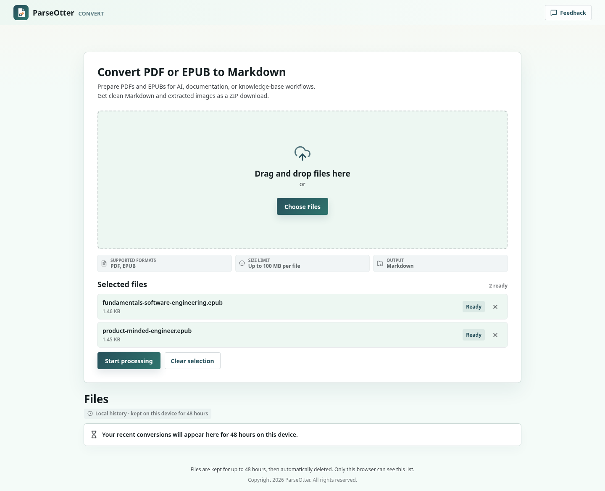
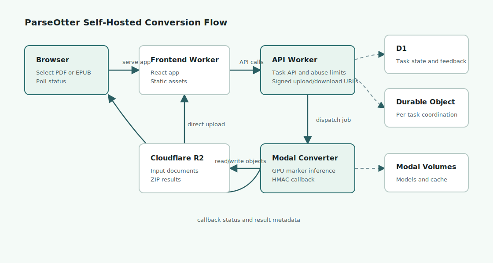

# ParseOtter

ParseOtter is an open-source, self-hostable PDF/EPUB-to-Markdown conversion service powered by Cloudflare Workers, R2, D1, Durable Objects, Modal GPU inference, and `marker-pdf`.

Try the hosted version: <https://www.parseotter.com/>



## What It Includes

- Browser upload UI for PDF and EPUB files.
- Direct multipart uploads from the browser to Cloudflare R2.
- Cloudflare Worker API for task creation, upload orchestration, polling, feedback, and downloads.
- D1 task state, feedback, abuse counters, and retention metadata.
- Durable Object coordination per conversion task.
- Modal GPU conversion backend using `marker-pdf`.
- Markdown preview and ZIP download with extracted assets.
- Default 48-hour result retention.
- Turnstile, rate limiting, anonymous usage controls, and HMAC-signed Modal callbacks.

## Architecture



The stack has three deployable parts:

- `frontend`: React + Vite app deployed as a Cloudflare Worker static asset app.
- `api-worker`: Hono API deployed to Cloudflare Workers with D1, R2, Durable Objects, Cron, and Worker secrets.
- `modal-converter`: Python 3.13 Modal app that runs GPU conversion jobs and calls the Worker back with signed results.

## Quick Start

Install local dependencies:

```bash
cd frontend
yarn install

cd ../api-worker
yarn install

cd ../modal-converter
uv sync
```

Run local checks:

```bash
cd frontend
yarn typecheck
yarn test
yarn build

cd ../api-worker
yarn cf-typegen
yarn typecheck
yarn test

cd ../modal-converter
uv run pytest
```

For deployment, start with [DEPLOYMENT.md](DEPLOYMENT.md). Use fresh D1/R2/Modal resources for a first public self-hosted install.

## Configuration

Public example names use ParseOtter placeholders:

- Frontend Worker: `parseotter-web`, `parseotter-web-production`
- API Worker: `parseotter-api`, `parseotter-api-production`
- D1: `parseotter-tasks-dev`, `parseotter-tasks-production`
- R2: `parseotter-files-dev`, `parseotter-files-production`
- Modal app: `parseotter-converter-dev`, `parseotter-converter-production`

Checked-in routes use `example.com`, `yourdomain.com`, and `your-*.workers.dev` placeholders. Replace every account ID, database ID, bucket name, endpoint, domain, and secret before deploying.

## Privacy And Retention

In the default deployment model:

- Uploaded source files and result ZIPs are stored in Cloudflare R2.
- Task metadata, feedback, usage counters, and retention timestamps are stored in Cloudflare D1.
- Result access expires after 48 hours by default.
- A Worker Cron cleanup marks expired tasks and deletes recorded R2 input/output objects.
- Browser local history is stored only in the user's browser local storage.

Self-hosters are responsible for their own privacy policy, user notices, Cloudflare/Modal configuration, data retention settings, logs, access controls, and abuse handling.

## Documentation

- [Deployment guide](DEPLOYMENT.md)
- [Roadmap](ROADMAP.md)
- [Fixture provenance](docs/FIXTURES.md)
- [Promotion plan](docs/PROMOTION_PLAN.md)
- [Contributing](CONTRIBUTING.md)

## Acknowledgements

ParseOtter builds on:

- [Cloudflare Workers](https://developers.cloudflare.com/workers/), [R2](https://developers.cloudflare.com/r2/), [D1](https://developers.cloudflare.com/d1/), and [Durable Objects](https://developers.cloudflare.com/durable-objects/)
- [Modal](https://modal.com/)
- [`marker-pdf`](https://github.com/datalab-to/marker)

## License

AGPL-3.0. See [LICENSE](LICENSE).
