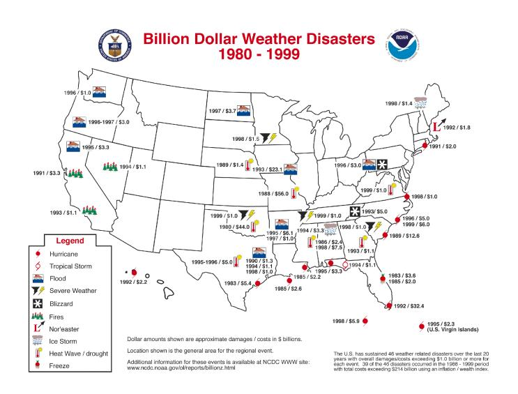
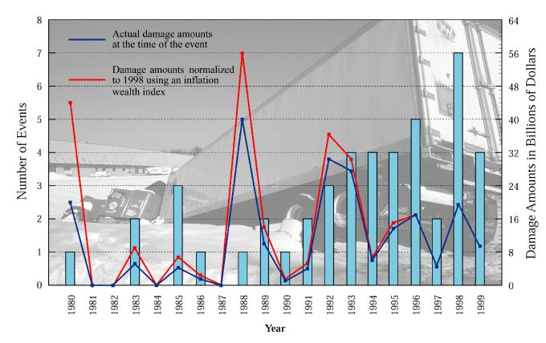
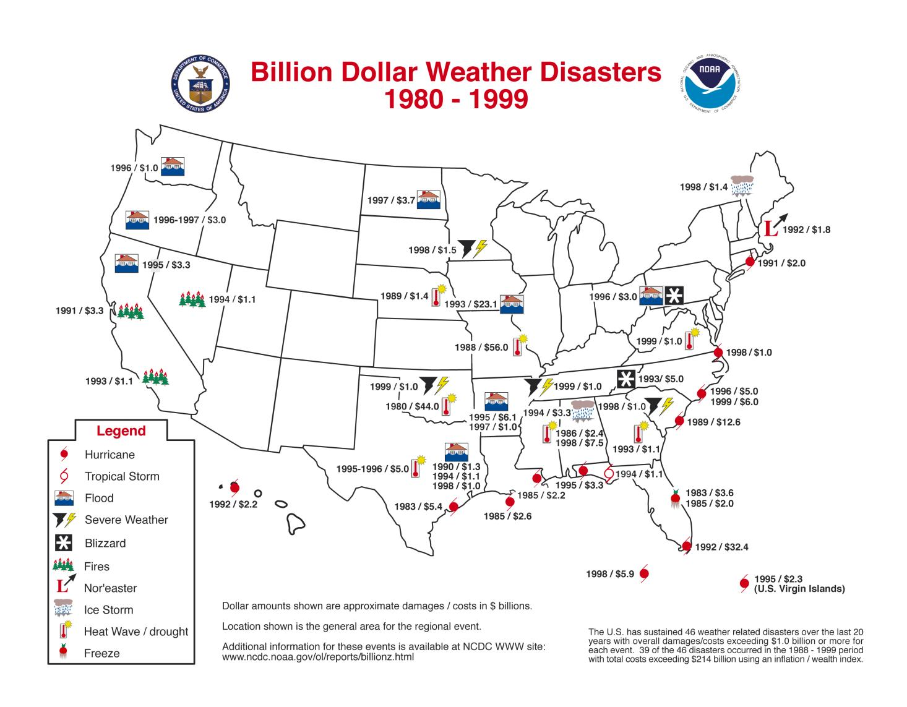
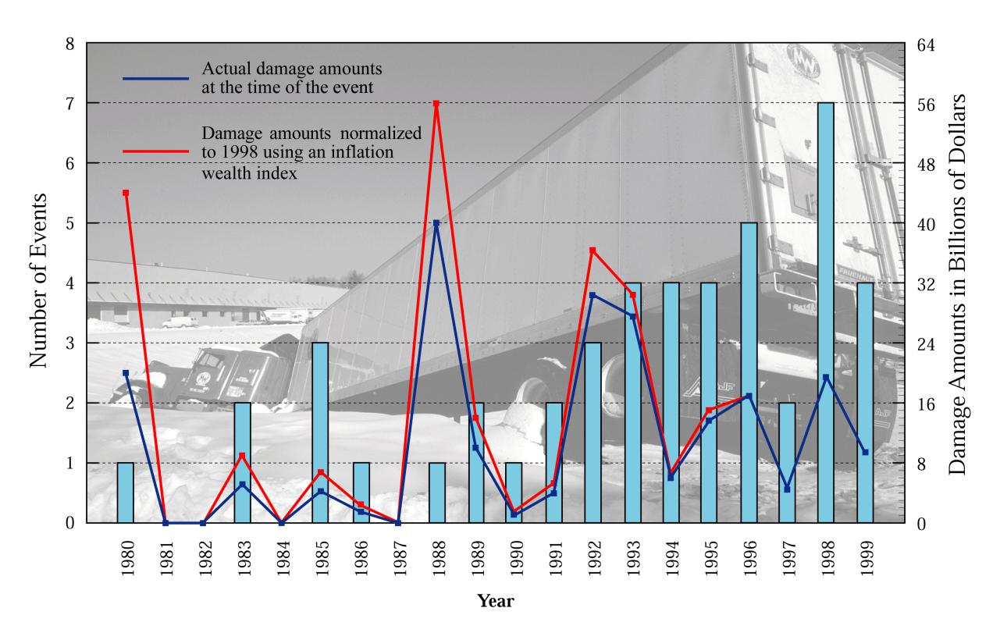
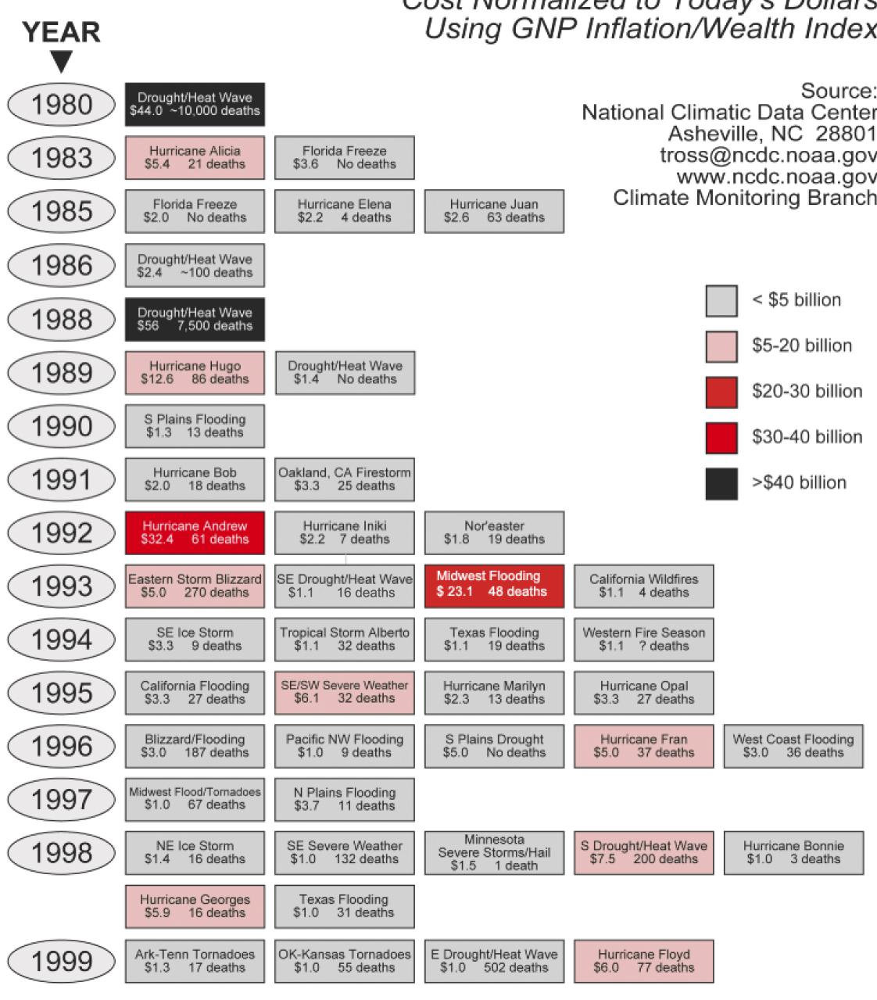
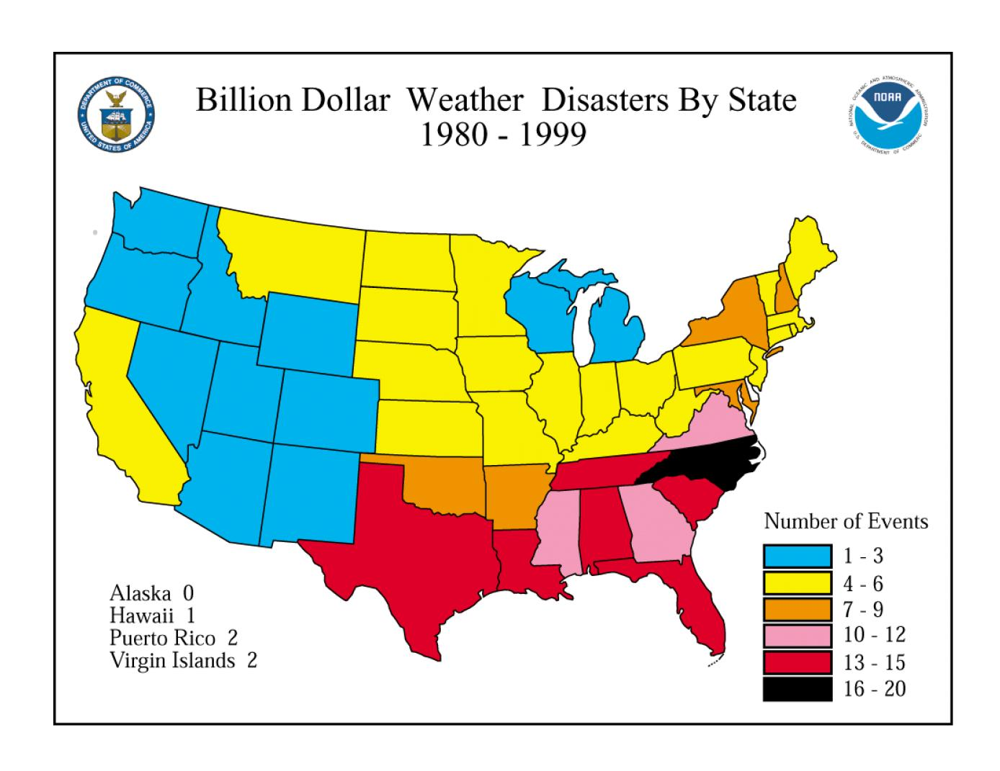
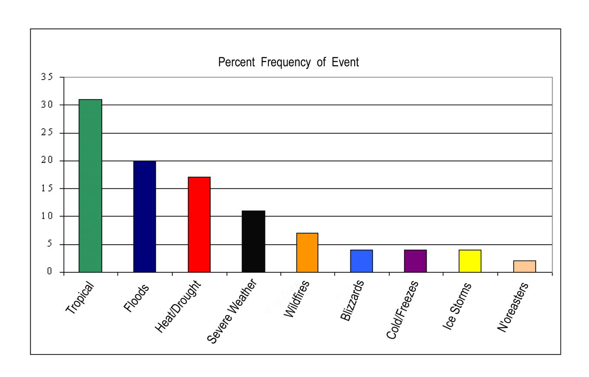
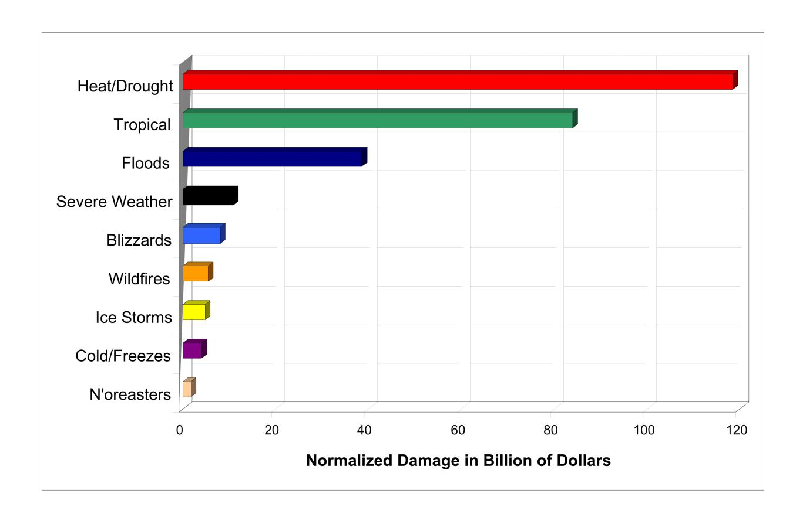
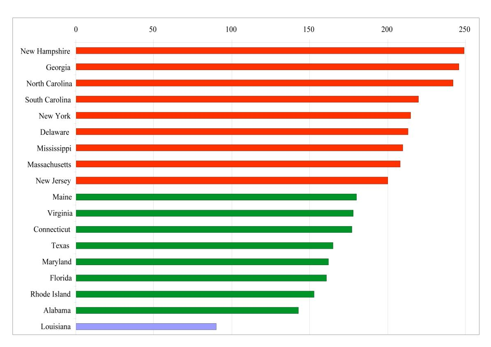
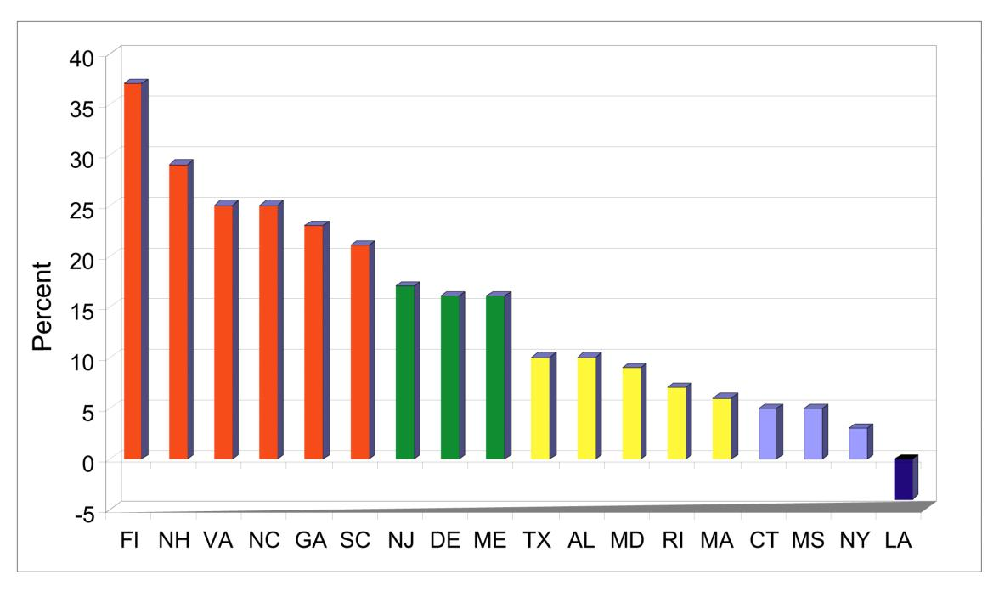

==================================================================== ======================================================================

## National Climatic Data Center

# A Climatology of Recent Extreme Weather and Climate Events

 **Tom Ross, Neal Lott**

US Department of Commerce NOAA/ NESDIS National Climatic Data Center Asheville, NC 28801-5696 October 2000

==================================================================== ======================================================================

### **National Climatic Data Center Technical Report No. 2000-02**

## **A Climatology of Recent Extreme Weather and Climate Events**

Tom Ross, Neal Lott

October 2000

U.S. Dept of Commerce National Oceanic and Atmospheric Administration National Environmental Satellite Data and Information Service National Climatic Data Center Asheville, NC 28801-5001

==================================================================== ======================================================================

#### A CLIMATOLOGY OF RECENT EXTREME WEATHER AND CLIMATE EVENTS

 Thomas F. Ross and J. Neal Lott National Climatic Data Center Asheville, North Carolina

#### **1. Introduction**

The National Climatic Data Center (NCDC) is responsible for monitoring and assessing the Earth's climate. Each month NCDC provides comprehensive analyses of global and U.S. temperature and precipitation to place the current state of the climate into historical perspective. Identification and assessment of extreme weather events is included as part of this effort. An "Extreme Weather and Climate Events" suite of web pages (Fig. 1) highlights these events and provides access to images, descriptions, statistics, and other detailed information for each event via the worldwide web (http://www.ncdc.noaa.gov/extremes.html).

One of our more popular web pages in the "Extreme Weather and Climate Events" suite is the "Billion Dollar U.S. Weather Disaster" page (http://www.ncdc.noaa.gov/ol/reports/billionz.html), which focuses on extreme events that caused more than \$1 billion in monetary losses in the United States, and provides links to detailed reports on many of these events. During the past twenty years (1980- 1999), 46 'billion-dollar' weather disasters occurred in the U.S. This report provides an overview of these disasters and the damage and loss of life they caused.

#### **2. U.S. Events, 1980-1999**

The U.S. sustained 46 weather-related disasters during the 1980-1999 period in which overall losses reached or exceeded \$1 billion at the time of the event. Thirty-nine of these disasters occurred since 1988 with total losses exceeding \$170 billion. Seven events occurred in 1998 alone.

Below is a list of these disasters in chronological order, beginning with the most recent. Two damage figures are given for events prior to 1996. The first figure represents actual dollar costs at the time of the event and is not adjusted for inflation. The value in parenthesis (if given) is the dollar cost normalized to 1998 dollars using a Gross National Product (GNP) inflation/wealth index. The total normalized losses from the 46 events are over \$275 billion. Figures 2 through 7 provide graphical representation of these statistics.

A wide variety of sources were used to compile these statistics and represents our effort to estimate the total costs for these events in both dollars and lives. These sources include NCDC's Storm Data publication, the National Weather Service, the Federal Emergency Management Agency, other U.S. government agencies, individual state emergency management agencies, regional and state climatologists, and insurance industry estimates. The process of gathering this information, verifying the data, and keeping it up-to-date is a complex one. In this report, damage estimates include both insured and uninsured losses. Fatality totals incorporate both direct and indirect deaths (i.e., deaths

not directly caused by the event but closely tied to it). Economic costs are included, if available, for widespread, long-lasting droughts (e.g., losses to agriculture plus related industries). Estimates are periodically updated as additional information becomes available.

Following is a review of these 'billion-dollar' disasters:

- **Hurricane Floyd** September 1999. Large, category 2 hurricane makes landfall in eastern North Carolina, causing 10-25 inch rains in 2 days, with severe flooding in North Carolina and some flooding in South Carolina, Virginia, Maryland, Pennsylvania, New York, New Jersey, Delaware, Rhode Island, Connecticut, Massachusetts, New Hampshire, and Vermont; estimate of at least \$6.0 billion damage/costs; 77 deaths.
- **Eastern Drought/Heat Wave** Summer 1999. Very dry summer and high temperatures, mainly in eastern U.S., with extensive agricultural losses; over \$1.0 billion damage/costs; estimated 502 deaths.
- **Oklahoma-Kansas Tornadoes** May 1999. Outbreak of F4-F5 tornadoes hit the states of Oklahoma and Kansas, along with Texas and Tennessee, Oklahoma City area hardest hit; over \$1.1 billion damage/costs; 55 deaths.
- **Arkansas-Tennessee Tornadoes** January 1999. Two outbreaks of tornadoes in 6-day period strike Arkansas and Tennessee; approximately \$1.3 billion damage/costs; 17 deaths.
- **Texas Flooding** October-November 1998. Severe flooding in southeast Texas from 2 heavy rain events, with 10-20 inch rainfall totals; approximately \$1.0 billion damage/costs; 31 deaths.
- **Hurricane Georges** September 1998. Category 2 hurricane strikes Puerto Rico, Florida Keys, and Gulf coasts of Louisiana, Mississippi, Alabama, and Florida panhandle, 15-30 inch 2-day rain totals in parts of Alabama/Florida; estimated \$5.9 billion damage/costs; 16 deaths.
- **Hurricane Bonnie** August 1998. Category 3 hurricane strikes eastern North Carolina and Virginia, extensive agricultural damage due to winds and flooding, with 10-inch rains in 2 days in some locations; approximately \$1.0 billion damage/costs; 3 deaths.
- **Southern Drought/Heat Wave** Summer 1998. Severe drought and heat wave from Texas/Oklahoma eastward to the Carolinas; \$6.0-\$9.0 billion damage/costs to agriculture and ranching; at least 200 deaths.
- **Minnesota Severe Storms/Hail** May 1998. Very damaging severe thunderstorms with large hail over wide areas of Minnesota; over \$1.5 billion damage/costs; 1 death.
- **Southeast Severe Weather** Winter-Spring 1998. Tornadoes and flooding related to El Nino in southeastern states; over \$1.0 billion damage/costs; at least 132 deaths.

- **Northeast Ice Storm** January 1998. Intense ice storm hits Maine, New Hampshire, Vermont, and New York, with extensive forestry losses; over \$1.4 billion damage/costs; 16 deaths.
- **Northern Plains Flooding** April-May 1997. Severe flooding in Dakotas and Minnesota due to heavy spring snow melt; approximately \$3.7 billion damage/costs; 11 deaths.
- **Mississippi and Ohio Valleys Flooding & Tornadoes** March 1997. Tornadoes and severe flooding hit the states of Arkansas, Missouri, Mississippi, Tennessee, Illinois, Indiana, Kentucky, Ohio, and West Virginia, with over 10 inches of rain in 24 hours in Louisville; estimated \$1.0 billion damage/costs; 67 deaths.
- **West Coast Flooding** December 1996-January 1997. Torrential rains (10-40 inches in 2 weeks) and snow melt produce severe flooding over portions of California, Washington, Oregon, Idaho, Nevada, and Montana; approximately \$3.0 billion damage/costs; 36 deaths.
- **Hurricane Fran** September 1996. Category 3 hurricane strikes North Carolina and Virginia, over 10-inch 24-hour rains in some locations, extensive agricultural and other losses; over \$5.0 billion damage/costs; 37 deaths.
- **Pacific Northwest Severe Flooding** February 1996. Very heavy, persistent rains (10-30 inches) and melting snow over Oregon, Washington, Idaho, and western Montana; approximately \$1.0 billion damage/costs; 9 deaths.
- **Blizzard of '96 Followed by Flooding** January 1996. Very heavy snowstorm (1-4 feet) over Appalachians, Mid-Atlantic, and Northeast; followed by severe flooding in parts of same area due to rain & snow melt; approximately \$3.0 billion damage/costs; 187 deaths.
- **Southern Plains Severe Drought** Fall 1995 through Summer 1996. Severe drought in agricultural regions of southern plains--Texas and Oklahoma most severely affected; approximately \$5.0 billion damage/costs; no deaths.
- **Hurricane Opal** October 1995. Category 3 hurricane strikes Florida panhandle, Alabama, western Georgia, eastern Tennessee, and the western Carolinas, causing storm surge, wind, and flooding damage; over \$3.0 (3.3) billion damage/costs; 27 deaths.
- **Hurricane Marilyn** September 1995. Category 2 hurricane devastates U.S. Virgin Islands; estimated \$2.1 (2.3) billion damage/costs; 13 deaths.
- **Texas/Oklahoma/Louisiana/Mississippi Severe Weather and Flooding** May 1995. Torrential rains, hail, and tornadoes across Texas - Oklahoma and southeast Louisiana southern Mississippi, with Dallas and New Orleans area (10-25 inch rains in 5 days) hardest hit; \$5.0-\$6.0 (5.5-6.6) billion damage/costs; 32 deaths.

- **California Flooding** January-March 1995. Frequent winter storms cause 20-70 inch rainfall and periodic flooding across much of California; over \$3.0 (3.3) billion damage/costs; 27 deaths.
- **Texas Flooding** October 1994. Torrential rain (10-25 inches in 5 days) and thunderstorms cause flooding across much of southeast Texas; approximately \$1.0 (1.1) billion damage/costs; 19 deaths.
- **Tropical Storm Alberto** July 1994. Remnants of slow-moving Alberto bring torrential 10- 25 inch rains in 3 days, widespread flooding and agricultural damage in parts of Georgia, Alabama, and panhandle of Florida; approximately \$1.0 (1.1) billion damage/costs; 32 deaths.
- **Western Fire Season** Summer-Fall 1994. Severe fire season in western states due to dry weather; approximately \$1.0 (1.1) billion damage/costs; death toll undetermined.
- **Southeast Ice Storm** February 1994. Intense ice storm with extensive damage in portions of Texas, Oklahoma, Arkansas, Louisiana, Mississippi, Alabama, Tennessee, Georgia, South Carolina, North Carolina, and Virginia; approximately \$3.0 (3.3) billion damage/costs; 9 deaths.
- **California Wildfires** Fall 1993. Dry weather, high winds and wildfires in Southern California; approximately \$1.0 (1.1) billion damage/costs; 4 deaths.
- **Midwest Flooding** Summer 1993. Severe, widespread flooding in central U.S. due to persistent heavy rains and thunderstorms; approximately \$21.0 (23.1) billion damage/costs; 48 deaths.
- **Drought/Heat Wave** Summer 1993. Southeastern U.S.; about \$1.0 (1.1) billion damage/costs to agriculture; at least 16 deaths.
- **Storm/Blizzard** March 1993. "Storm of the Century" hits entire eastern seaboard with tornadoes (Florida), high winds, and heavy snows (2-4 feet); \$3.0-\$6.0 (3.3-6.6) billion damage/costs; approximately 270 deaths.
- **Nor'easter of 1992** December 1992. Slow-moving storm batters northeast U.S. coast, New England hardest hit; \$1.0-\$2.0 (1.2-2.4) billion damage/costs; 19 deaths.
- **Hurricane Iniki** September 1992. Category 4 hurricane hits Hawaiian island of Kauai; about \$1.8 (2.2) billion damage/costs; 7 deaths.

- **Hurricane Andrew** August 1992. Category 4 hurricane hits Florida and Louisiana, high winds damage or destroy over 125,000 homes; approximately \$27.0 (32.4) billion damage/costs; 61 deaths.
- **Oakland Firestorm** October 1991. Oakland, California firestorm due to low humidities and high winds; approximately \$2.5 (3.3) billion damage/costs; 25 deaths.
- **Hurricane Bob** August 1991. Category 2 hurricane–mainly coastal North Carolina, Long Island, and New England; \$1.5 (2.0) billion damage/costs; 18 deaths.
- **Texas/Oklahoma/Louisiana/Arkansas Flooding** May 1990. Torrential rains cause flooding along the Trinity, Red, and Arkansas Rivers in Texas, Oklahoma, Louisiana, and Arkansas; over \$1.0 (1.3) billion damage/costs; 13 deaths.
- **Hurricane Hugo** September 1989. Category 4 hurricane devastates South and North Carolina with ~ 20 foot storm surge and severe wind damage after hitting Puerto Rico and the U.S. Virgin Islands; over \$9.0 (12.6) billion damage/costs (about \$7.1 (9.9) billion in Carolinas); 86 deaths (57--U.S. mainland, 29--U.S. Islands).
- **Northern Plains Drought** Summer 1989. Severe summer drought over much of the northern plains with significant losses to agriculture; at least \$1.0 (1.4) billion in damage/costs; no deaths reported.
- **Drought/Heat Wave** Summer 1988. 1998 drought in central and eastern U.S. with very severe losses to agriculture and related industries; estimated \$40.0 (56.0) billion damage/costs; estimated 5,000 to 10,000 deaths (includes heat stress-related).
- **Southeast Drought and Heat Wave** Summer 1986. Severe summer drought in parts of the southeastern U.S. with severe losses to agriculture; \$1.0-\$1.5 (1.6-2.4) billion in damage/costs; estimated 100 deaths.
- **Hurricane Juan** October-November 1985. Category 1 hurricane--Louisiana and Southeast U.S.–severe flooding; \$1.5 (2.6) billion damage/costs; 63 deaths.
- **Hurricane Elena** August-September 1985. Category 3 hurricane--Florida to Louisiana; \$1.3 (2.2) billion damage/costs; 4 deaths.
- **Florida Freeze** January 1985. Severe freeze central/northern Florida; about \$1.2 (2.0) billion damage to citrus industry; no deaths.
- **Florida Freeze** December 1983. Severe freeze central/northern Florida; about \$2.0 (3.6) billion damage to citrus industry; no deaths.

- **Hurricane Alicia** August 1983. Category 3 hurricane--Texas; \$3.0 (5.4) billion damage/costs; 21 deaths.
- **Drought/Heat Wave** June-September 1980. Central and eastern U.S.; estimated \$20.0 (44.0) billion damage/costs to agriculture and related industries; estimated 10,000 deaths (includes heat stress-related).

#### **3. Population Changes and Societal Impacts**

The general increase in population since 1900 has placed more people at risk when an extreme weather event occurs. Rapid growth in U.S. coastal population places more people in "harms-way" when hurricanes make landfall. For example, the coastal population in Florida increased from approximately one million in 1940 to slightly more than 10 million in 1990, according to the U.S. Census Bureau. Also, the significant increase in the number of homes and businesses built in flood plains over the past fifty years increases the risk and frequency for high-cost flooding events. If these societal trends continue, the costs associated with weather-related disasters will continue to increase, regardless of any factors associated with climate change.

For the years 1980-1999, about 30% of the billion dollar events were either hurricanes or tropical storms. According to Pielke and Landsea, 1998, "...all else being equal, each year the United States has at least a 1 in 6 chance of experiencing losses related to hurricanes of at least \$10 billion (in normalized 1996 dollars)." Climate patterns can significantly alter these odds (Gray et al., 1997), and each year the stakes rise due to coastal population growth and development. In 1990, Dade and Broward Counties in south Florida were home to more people than lived in all 109 counties along the Gulf and Atlantic coasts from Texas through Virginia in 1930 (Pielke, 1995). Figures 8 and 9 illustrate the trends in coastal exposure by state from 1980 through 1993 (Ayscue, 1996 and IIPLR, 1995). Insured coastal property values increased by 100% to 250% for most states during this period, and have increased further since then.

In the three decades preceding Hurricanes Hugo (1989) and Andrew (1992), few major hurricanes struck the United States. However, from 1941 through 1950, ten major hurricanes (sustained wind speed greater than 110 miles-per-hour) struck the continental United States, seven of which made landfall in Florida. From 1951 through 1960, eight major hurricanes struck the United States, seven along the East Coast. For the next 30 years (1961-1990), the only major hurricane to strike the Florida peninsula was Hurricane Betsy in 1965. Similarly, during this period, no major hurricanes made landfall on the East Coast until the mid-1980s. (Ayscue, 1996). However, some studies (Gray et al., 1997) indicate that a return to the more active hurricane seasons typical of the 1940s and 1950s may be in store for us. The combination of more active hurricane seasons with recent population increases along the U.S. East and Gulf coasts provide conditions that may lead to more frequent major disasters.

#### **4. Summary and Conclusion**

In sixteen of the past twenty years, the U.S. has experienced at least one weather-related billion-dollar disaster. Since 1988, at least one disaster occurred each year, with only one such event in 1988 and 1990, and seven billion-dollar events in 1998. Two of the 1998 disasters were caused by hurricanes. Overall, hurricanes and tropical storms account for 14 of the 46 events and 30% of the monetary losses (normalized to 1998). The eight major droughts which have occurred since 1980 account for the largest percentage (43%) of weather-related losses. Figures 6 and 7 provide additional statistics for the distribution of events by type.

The clearest evidence which explains the increase in losses due to hurricanes, points to changes in society, not in climate fluctuations. In fact, Pielke and Landsea, 1998 state, "It is only a matter of time before the nation experiences a \$50 billion or greater storm, with multi-billion dollar losses becoming increasingly more frequent. Climate fluctuations that return the Atlantic basin to a period of more frequent storms will enhance the chances that this time occurs sooner, rather than later."

Although some studies (Chagnon et al., 1999) suggest that trends such as population increases, population shifts into higher risk areas, and increasing wealth have been the key factors in weatherrelated disasters (as opposed to historical trends in the frequency or strength of such events), there is evidence that climate change may affect the frequency of certain extreme weather events. An increase in population and development in flood plains, along with an increase in heavy rain events in the U.S. during the past fifty years (Karl et al., 1996), have gradually increased the economic losses due to flooding. If the climate continues to warm, the increase in heavy rain events is likely to continue. While trends in extratropical cyclones are not clear, there are projections that the incidence of extreme droughts will increase if the climate warms throughout the 21st century (Easterling et al., 2000).

Regardless of these factors and trends, Americans will continue to cope with major economic and human losses due to hurricanes, droughts, and other weather-related disasters. As new events occur and updated statistics become available, NCDC will continue to update its worldwide web system (as shown in Figure 1, accessible via http://www.ncdc.noaa.gov/extremes.html).

### **5. References**

Changnon, Stanley A., K.E. Kunkel, and R.A. Pielke Jr., 1999. Temporal Fluctuations in Weather and Climate Extremes That Cause Economic and Human Health Impacts: A Review, *Bulletin of the American Meteorological Society*, Vol. 80, No. 6, Jun. 1999, pp 1077-1098.

Easterling, David R., Gerald A. Meehl, Camille Parmesan, Stanley A. Changnon, Thomas R. Karl, and Linda O. Mearns: Climate Extremes: Observations, Modeling, and Impacts, *Science,* Sep 22, 2000: 2068-2074.

Gray, W.M., J.D. Shaeffer, and C.W. Landsea, 1997: Climate Trends Associated with Multidecadal Variability of Atlantic Hurricane Activity. Hurricanes, Climate and Socioeconomic Impacts, H.F. Diaz and R.S. Pulwarty, Eds., Springer, 15-53.

Insurance Institute for Property Loss Reduction (IIPLR) and Insurance Research Council. 1995. Coastal Exposure and Community Protection: Hurricane Andrew's Legacy. Boston, Massachusetts: IIPLR.

Karl, Thomas R, R.W. Knight, D.R. Easterling, and R.G. Quayle, 1996. Indices of Climate Change for the United States, Bulletin of the American Meteorological Society, Vol. 77, No. 2, Feb. 1996, pp 279-292.

Natural Hazards Research and Applications Information Center, Institute of Behavioral Science, University of Colorado, 1996. Natural Hazards Research Working Paper #94 – Hurricane Damage to Residential Structures: Risk and Mitigation, Jon K. Ayscue, The Johns Hopkins University, Baltimore, Maryland.

Pielke, R.A., Jr., 1995: Hurricane Andrew in South Florida: Mesoscale Weather and Societal Responses. National Center for Atmospheric Research, 212 pp.

Pielke, R. A. and C.W. Landsea, 1998: Normalized Hurricane Damages in the United States, 1925- 1995, Weather and Forecasting, September 1998, pp. 621-631.

| <u>U.S.</u> <u>Hurricanes</u>     | <u>Heavy</u> <u>Precipitation</u>      | Temperature Extremes        | <u>U.S.</u> <u>Tornadoes</u>   |
|--------------------------------------|-------------------------------------------|--------------------------------|-----------------------------------|
| Billion \$\$ Weather Disasters | Yucalan                                   | EATHER AND                     | 1991-2000 Weather Events    |
| Global Climate Change          | - Bellas - CLIMATE                        | Janoita                        | Historical Global Extremes  |
| El Nino/ La Nina                  | GLIIVIA I E Henduras Nicarogua      | Caribbean Sea               | <u>Satellite</u> <u>Images</u> |
| Climate of 2000                   | <u>U.S. Local</u> <u>Storm Reports</u> | <u>Climatic</u> <u>Data</u> | U.S. Radar Composites          |

**Fig 1. Extreme Weather and Climate Events Web System, http://www.ncdc.noaa.gov/extremes.html** 

**Fig 2. Billion Dollar U.S. Weather Disaster Map, 1980-1999, Adjusted Costs**

**Fig 3. Bar Chart of Annual Number of U.S. Billion Dollar Weather Disasters, 1980-1999**

**Fig 4. Billion Dollar U.S. Weather Disasters, 1980-1999 - Chronological Chart** 

**Fig 5. Billion Dollar U.S. Weather Disasters By State, 1980-1999** 

**Fig 6. Distribution of Events by Type, as % of the Total (46 events for 1980-1999)**

**Fig 7. Distribution of Events by Type, Showing Total Normalized Losses for each Category**

**Fig 8. Percentage increase in the value of insured coastal property exposures by state, 1980-1993 (From IIPLR, 1995)** 

 **Fig 9. Coastal population change, 1980-1993 (From IIPLR, 1995)**