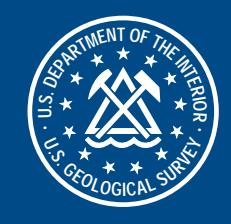
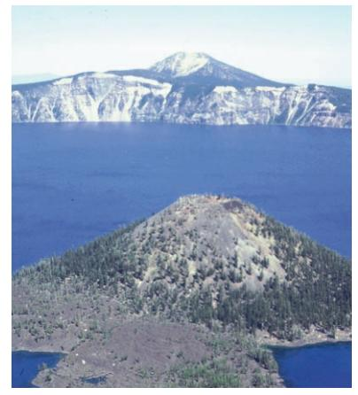

# Output Preview

This excerpt is rendered from the generated `raw.md`. The full conversion artifact is not committed.

# THE USGS MARINE AND COASTAL GEOLOGY PROGRAM



U.S. DEPARTMENT OF THE INTERIOR

U.S. GEOLOGICAL SURVEY

# Crater Lake National Park: Presently Tranquil



View of Crater Lake looking east over Wizard Island to Mount Scott, the highest point in the park.

#### Young calderas pose a number of hazards for human activity

## Raw Markdown Excerpt

```markdown
# THE USGS MARINE AND COASTAL GEOLOGY PROGRAM


U.S. DEPARTMENT OF THE INTERIOR

U.S. GEOLOGICAL SURVEY

# Crater Lake National Park: Presently Tranquil


View of Crater Lake looking east over Wizard Island to Mount Scott, the highest point in the park.

#### Young calderas pose a number of hazards for human activity
```
