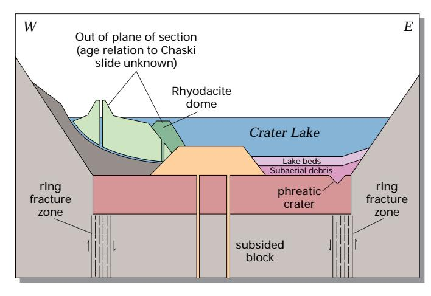
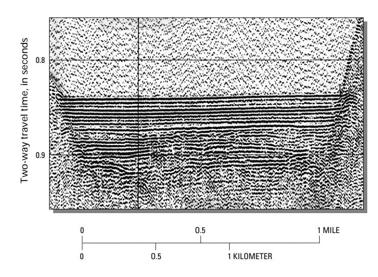
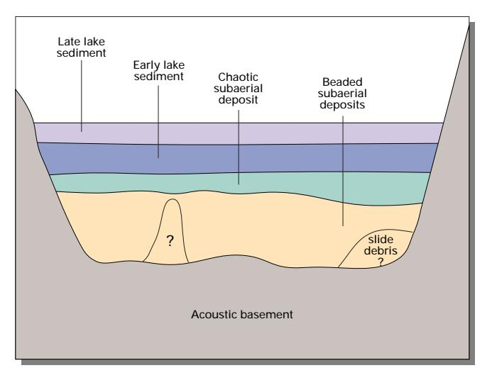

# THE USGS MARINE AND COASTAL GEOLOGY PROGRAM

U.S. DEPARTMENT OF THE INTERIOR

U.S. GEOLOGICAL SURVEY

# Crater Lake National Park: Presently Tranquil

View of Crater Lake looking east over Wizard Island to Mount Scott, the highest point in the park.

"Crater Lake partially fills a 1,200-meter deep caldera, a depression formed by collapse of ancestral Mount Mazama during the violent eruption of 50 cubic kilometers of magma, or molten rock, about 7,700 years ago (6,845 ± 50 14C years before present). By comparison, Mount St. Helens in 1980 erupted about half a cubic kilometer of new magma. Geologic history shows that catastrophic events of this kind can repeat. Are volcanic eruptions likely again at Crater Lake? One of the approaches U.S. Geological Survey scientists are using to answer this important question is to unravel the geologic history of the Crater Lake caldera floor."

—Dr. Hans Nelson and Dr. Charles R. Bacon U.S. Geological Survey

#### Young calderas pose a number of hazards for human activity

The foremost threat from young calderas is that of renewed volcanism. Several post-caldera volcanic features are present at Crater Lake, although only Wizard Island breaks the lake surface. The youngest post-caldera volcano is a small rhyodacite dome in Crater Lake on the east flank of Wizard Island that dates from about 5,000 years ago. Another eruption of the magnitude of the calderaforming event is unlikely within the next several thousand years: no volcanic rocks or layers of ash younger than the dome are known at Crater Lake, seismic profile studies of lake sediment show no evidence of subsurface magma movement, and there have been no earthquakes of the kind associated with volcanism. However, there is every reason to expect future activity in the place where it has been occurring for at least 400,000 years. Should there be an eruption within the caldera, it would likely happen underwater, increasing the possibility of enhanced explosive power due to the interaction of magma and hot rock with water.

Calderas filled with water can produce tremendous flooding in the immediate vicinity if the caldera wall fails, as happened to Aniakchak Crater in Alaska when its rim was breached. Crater Lake shows no signs of imminent crater-wall failure: the last major wall failure occurred over 7,500 years ago, after the formation of the subaerial central platform of post-caldera lava flows, but before the lake water began accumulating. The Chaski slide, one block of which forms a prominent bench east of Crater Lake Lodge, was the last major landslide event and carried debris to the center of the caldera floor.

Schematic geologic cross section across the caldera floor of Crater Lake showing relationship and sequence of formation of post-caldera volcanic features, subaerial debris layers, and lake sediment beds. Not drawn to scale or as an exact cross section line. Water-filled craters or calderas can release very large quantities of  $\mathrm{CO}_2$  as happened at Lake Nyos, Cameroon, where hundreds of villagers in the vicinity of the Lake died of asphyxiation. Crater Lake, however, produces some circulation in its bottom half from hydrothermal activity on the caldera floor and strong circulation throughout from normal atmospheric influences. Moreover, sediment from the lake bottom shows no indication of the presence of gas, and the lake itself is surprisingly well-oxygenated, considering its depth. There is no evidence that Crater Lake is likely to turn over, as did Lake Nyos, and release large amounts of  $\mathrm{CO}_2$ .

EXPLANATION

Intracaldera tuff and breccia (possibly much thicker than shown)

Lavas and pyroclastic rocks of Mt. Mazama

EXPLANATION

Andesite of central platform (subaerial)

Chaski slide

### **Understanding the history and evolution of calderas may help scientists predict when and where disasters are likely to occur**

The interdisciplinary study of the Crater Lake caldera floor required extensive logistical assistance from the **National Park Service** and collaboration with scientists from **Oregon State University** in use of underwater vehicles. U.S. Geological Survey (USGS) scientists determined the geologic history of Crater Lake itself through detailed studies of the caldera and the Pacific ocean floor. The climactic eruption of Mount Mazama resulted in deposition of pumice and ash over more than a million square kilometers of the Pacific Northwest. Soon after, ash deposited in the Columbia River drainage basin was transported westward from the Pacific coast up to 700 kilometers offshore on the northeast Pacific ocean floor by turbidity currents along deep-sea channels. Collapse of the former volcanic edifice along a ring fracture system, forming the caldera, occurred during the eruption and compensated for the ejection of the 50 cubic kilometers of magma. Part of the erupted material fell within the developing caldera to form a plug of intracaldera tuff that may be as much as 2 kilometers thick. The basin that now contains Crater Lake is the resulting collapse caldera, 1,200 meters deep and 8 to10 kilometers in diameter at the rim. In a matter of only a few hundred years, the caldera was partially filled, first with landslide debris from the walls and later with post-caldera volcanic rocks, water, and lake sediment.

## **USGS workers used Crater Lake's well-preserved, detailed geologic history to develop a genetic model of small caldera evolution**

Post-caldera volcanic vents, geothermal features, and buried steam-explosion (phreatic) craters detected by seismic surveys collectively outline a ring fracture zone along which Mount Mazama subsided. These features began to form after caldera collapse about 7,700 years ago, but before the caldera filled with water to essentially its present level over the following 300 years. The large central platform of subaerial lava flows and domes erupted before the lake was present. Radiocarbon dates taken from lake-bottom organic matter indicate that the lake covered the central platform within at least 150 years of the caldera collapse. Wizard Island, one of the two major caldera-floor volcanic cones, erupted additional material into the

lake as it finished filling. These subaqueous Wizard Island deposits accumulated to a height 70 meters below today's lake surface, and the subaerial island continued to grow nearly 250 meters above the present lake surface. Merriam Cone, the other large volcanic cone, erupted completely underwater, rising more than 400 meters above the caldera floor, but it remains 200 meters below the present lake surface.

Evidence for the timing of these events is found in detailed analysis of sediment sources and of radiocarbon dates from the central platform deposits. The age of the central platform sediment shows that the last main volcanic event, extrusion of a small rhyodacite dome east of Wizard Island, happened about 5,000 years ago. Investigations also show that the early lake sediment contained pollen from gradual reestablishment of post-eruption forest surrounding the lake as well as primitive diatoms that lived in the early, more hydrothermal water. Warmer and drier climatic conditions existed during the lake's early history, but a colder and wetter neoglacial climate has dominated for the past several thousand years.

There is evidence that large slope failures may have been triggered while volcanic and seismic activity continued up to 5,000 years ago. Since then, the geologic history of the caldera floor is marked by a distinct absence of volcanic activity. Mass wasting from the caldera walls continues, but on a much reduced scale. Lake bottom sediments now cover the chaotic subaerial debris wedges and volcanic deposits laid down as the lake was forming. This lake sediment blanket on the floor is well-bedded with a variety of sediment sizes ranging from gravel at the edge to very fine sand toward the lake center. Organic-rich muds also have accumulated on the submerged volcanic features. The lake sedimentation rate is currently high, but remains considerably lower than that found during the subaerial mass wasting that occurred before the lake formed.

Other USGS studies at Crater Lake, either published in scientific journals or in progress, include research on development of the shallow magma chamber which produced the climactic eruption, eruptive processes and caldera collapse as indicated by features of the volcanic deposits, and the early history of Mount Mazama and the many smaller volcanoes in the Crater Lake area. In addition, scientists from the USGS Cascades Volcano Observatory periodically make geodetic measurements and look for tilting or swelling of the caldera area that might forewarn of renewed volcanic activity.

*Interpretive drawing (right) of a continuous seismic airgun profile (left) across the east basin showing the subsurface sedimentary units of the caldera floor. The early lake sediment was probably deposited prior to 5,000 years ago while active volcanic eruptions*

*were occurring, whereas the late lake sediment has been deposited during the period of volcanic quiescence over the past 5,000 years.*